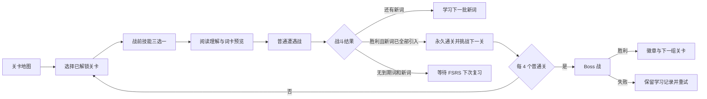

# 游戏化战斗垂直切片开发计划

> 状态：核心垂直切片已实现，持续优化  
> 更新日期：2026-07-21  
> 目标版本：5 个节点的可玩垂直切片（4 个普通关 + 1 个 Boss）

## 1. 文档目的

本文档是“我是卷王 · 暴打单词怪”战斗游戏化的开发期单一真相。它记录下一阶段的产品目标、架构边界、实施顺序、测试门禁和停止条件，防止后续只记住视觉包装而忘记核心循环。

本文档属于尚未落地的开发设计，因此保存在代码仓库 `docs/` 中；实现完成后，代码和本文档必须同步更新。

## 2. 当前状态

### 已实现

- 本地优先的 Vite + React + TypeScript 静态应用，无后端依赖。
- FSRS 是唯一学习调度源，决定到期复习、题型阶段和长期稳定掌握。
- AI 按固定关卡词池生成阅读理解，失败时可离线回退。
- 每关固定 25 个目标词；高考词库为 148 个普通关、8 个近似等量章节。
- 每轮优先到期词，再引入最多 8 个新词；未到期词不用于凑数。
- 同一关的 25 个词分批引入；战斗胜利且新词全部引入后永久通关。
- 通关与长期掌握分离；到期复习不会重新锁关。
- 学习记录和跨词库覆盖率保存在浏览器本地。

### 尚未实现

- 完整本地行为事件导出与留存分析面板。
- 更多技能、怪物和声音资产。

## 3. 产品判断

当前产品已经解决：

- 学什么；
- 何时复习；
- 如何把单词放进阅读语境。

下一阶段要验证：

> 答题结果转化为攻击、连击、反击和 Boss 击败后，玩家是否更愿意完成当前关并继续下一关？

首版不追求“大而全的游戏系统”，只验证战斗核心循环是否成立。

## 4. 垂直切片范围

垂直切片包含：

1. 4 个普通关；
2. 1 个 Boss 节点；
3. 一只普通词怪及其待机、受击、攻击、击败状态；
4. 一只 Boss 及三个战斗阶段；
5. 连击、暴击、玩家护盾、敌人生命；
6. 战前技能三选一；
7. 一至三星结算；
8. 本地游戏进度和本地事件记录。

## 5. 目标用户流程



## 6. 核心战斗规则

### 6.1 普通遭遇战

- 一个现有 Memory Chain 对应一次词怪遭遇。
- 一次挑战最多使用两个 AI 阅读链；候选不足时自然缩短，不强制凑满。
- 每道题是一次攻防结算：
  - 正确：攻击命中；
  - 快速正确：显示暴击；
  - 连续正确：提高连击和表现分；
  - 错误或超时：词怪反击，连击清零；
  - 使用提示：不改变正确性，但降低表现奖励。
- 首版不得因动画或额外伤害跳过既定题目。FSRS 安排的题仍按顺序结算。

### 6.2 玩家状态

- 初始护盾：3 点。
- 错误或超时损失 1 点护盾。
- 护盾归零时本次战斗失败；已完成题目的 FSRS 记录保留，未答题目不产生记录并继续保持待复习状态。
- 战斗失败不会降低已经掌握的单词，也不会回滚关卡学习进度。

### 6.3 连击与暴击

- 连续答对 2 题：连击开始。
- 连续答对 3 题：攻击反馈升级。
- 连续答对 5 题：触发所选技能的强化效果。
- 答错或超时：连击清零。
- 反应时间低于题目时限的 40% 时显示暴击。
- 连击和暴击影响战斗表现分、动画与星级，不改变 FSRS 评分。

### 6.4 学习进度与战斗胜负的关系

这两套状态必须分离：

- FSRS 学习进度决定到期复习、题型阶段和长期稳定掌握；
- 战斗状态决定本次挑战的胜负、连击、星级和奖励；
- 战斗胜利不得直接把单词标记为掌握；
- 战斗失败不得删除学习记录；
- 每关固定 25 个新词，每轮最多引入 8 个；胜利且 25 个词均已至少引入一次后永久解锁下一关；
- 已通关关卡只在存在到期词时提供复习入口，未到期词不得为了重玩而进入队列；
- FSRS Review 状态且稳定性达到 21 天才计入稳定掌握；稳定性达到 7 天后采用主动提取题型。

### 6.5 作答质量与 FSRS 评分

- 答错或超时：Again；
- 使用提示或接近时限才答对：Hard；
- 正常速度独立答对：Good；
- 非选择题中快速完成主动回忆：Easy；
- 选择题属于识别题，即使快速答对也最高为 Good。

### 6.6 频率混合与难度曲线

- 词库原始顺序是高频到低频，但关卡不得直接使用连续频率切片。
- 每关固定 25 个词，必须混合四个频率带，不能出现全高频或全低频的完整关卡。
- 关卡曲线从前期 `40% / 30% / 20% / 10%`（高频为主）平滑过渡到后期 `10% / 20% / 30% / 40%`（低频为主）。
- 每个可容纳四带的批次至少保留每带 1 个词；累计分配必须为后续关卡预留各带名额，避免尾段断带。
- 低于当前考试层级的基础词作为高频锚点分散到各关，不得集中堆在词库尾部形成连续简单关。
- “轻松”与“硬核”仅在当前混合关内偏向高频或低频，仍需保留所有可用频率带；“标准”保持关卡原始混合顺序。
- FSRS 到期复习优先级始终高于频率曲线，频率混合主要约束新词引入。

## 7. Boss 设计

### 7.1 出现节奏

- 每 4 个普通关插入一个 Boss 节点。
- 每章最后剩余不足 4 关时，章节末仍增加一个 Boss。
- Boss 节点不占普通关编号，例如普通关 1–4 后出现 Boss 1，随后进入普通关 5。

### 7.2 Boss 词池

- Boss 先覆盖自身固定 25 词池，再加入前四关中已经到期的薄弱复习词。
- 薄弱排序依据现有学习状态：
  1. 到期且答错率高；
  2. Relearning 状态；
  3. 稳定性低；
  4. 最近反应慢。
- Boss 选词逻辑必须是确定性的纯函数，并有单元测试。

### 7.3 三阶段

1. 识义：选择正确释义；
2. 破甲：听音拼写；
3. 终结：无提示主动提取。

Boss 敌人生命归零且玩家护盾未归零视为击败。Boss 失败不回滚已记录的 FSRS 作答；自身新词尚未全部引入时，胜利后进入下一批而不提前清关。

## 8. 战前技能

每次挑战前随机出现三个技能，玩家选择一个。首版候选：

| 技能 | 战斗效果 | 学习数据影响 |
| --- | --- | --- |
| 稳扎 | 第一次答错不清空连击 | 无 |
| 洞察 | 获得一次无惩罚提示 | 正确性仍按真实答案记录 |
| 狂卷 | 快速答题表现分提高，计时更紧 | 无 |
| 回响 | 听音题战斗伤害提高 | 无 |
| 破译 | 语境选择题可排除一个错误项 | 无 |

技能不得修改 FSRS 卡片、稳定掌握或答案判定。

## 9. 领域架构

### 9.1 新增纯领域模块

#### `src/domain/combat.ts`

职责：

- `CombatState`；
- `CombatAction`；
- 战斗 reducer；
- 连击、暴击、护盾和胜负计算；
- 纯函数，无 React、DOM、存储或 FSRS 依赖。

建议输入：

```ts
interface ResolvedCombatAnswer {
  correct: boolean;
  responseTimeMs: number;
  timeLimitMs: number;
  mode: GameMode;
  usedHint: boolean;
}
```

#### `src/domain/boss.ts`

职责：

- 从固定普通关词池中确定 Boss 薄弱词；
- Boss 阶段切换；
- Boss 胜负条件。

#### `src/domain/gameProgress.ts`

职责：

- 游戏进度类型；
- 默认值与版本迁移；
- 星级、最高连击、Boss 徽章和累计击败数更新。

### 9.2 新增 Hook

#### `src/hooks/useCombat.ts`

职责：

- 维护当前战斗状态；
- 接收已结算答案事件；
- 输出短生命周期表现事件，例如 `hit / critical / hurt / defeated`；
- 不负责写 FSRS。

#### `src/hooks/useGameProgress.ts`

职责：

- 使用 IndexedDB 保存独立游戏进度；
- 存储 key：`wordbuddy.game.progress.v1`；
- 不修改现有 `LearningState.version`。

### 9.3 现有模块改造

#### `src/hooks/useGameSession.ts`

- 增加独立的 `onAnswerResolved` 回调；
- 回调只传作答事实，不传战斗结果；
- 现有 `onRecord` 继续只负责学习记录。

#### `src/components/PracticeSession.tsx`

- 用 `CombatArena` 包装现有题目区域；
- 保留现有题型组件，不在题型内部实现战斗逻辑；
- 完成页增加战斗结算信息。

## 10. 游戏进度模型

游戏数据与学习数据分开保存：

```ts
interface GameProgressV1 {
  version: 1;
  levelResults: Record<string, {
    stars: 0 | 1 | 2 | 3;
    bestCombo: number;
    bestScore: number;
    wins: number;
    updatedAt: string;
  }>;
  bossResults: Record<string, {
    defeated: boolean;
    bestScore: number;
    attempts: number;
    updatedAt: string;
  }>;
  unlockedSkillIds: string[];
  totals: {
    monstersDefeated: number;
    criticalHits: number;
    highestCombo: number;
  };
}
```

关卡 key 使用 `${bankId}:level:${levelNumber}`，Boss key 使用 `${bankId}:boss:${bossNumber}`。

## 11. UI 组件

首版新增：

- `CombatArena.tsx`：战斗舞台；
- `CombatHud.tsx`：玩家护盾、连击、敌人生命和蓄力；
- `MonsterSprite.tsx`：词怪状态；
- `DamageNumber.tsx`：短生命周期伤害/暴击反馈；
- `SkillDraft.tsx`：战前技能三选一；
- `BattleResult.tsx`：星级、最高连击、掌握增长和下一步；
- `BossNode.tsx`：关卡地图 Boss 节点。

训练页目标布局：

```text
桌面 / 平板：
┌────────────── 第一人称战斗场景 ──────────────┐
│ [关卡模式 / 题目进度 / 护盾 / 连击 / 敌人生命 / 退出] │
│                                               │
│ 大型透明词怪作为背景主视觉      [右侧阅读理解] │
│                                               │
│              底部悬浮单行卡牌区               │
│ [词卡][词卡][词卡] ...              [开始挑战] │
└───────────────────────────────────────────────┘

手机预览：保持上方怪兽战场、下方独立卡牌区；卡牌在牌区内单行横滑且不显示轨道，开始按钮固定在牌区右侧。阅读理解固定在战场右侧并完整适配，不滚动。

正式考核：题目面板覆盖战场，不显示战前卡牌；阅读理解默认收起为左下角入口，用户点击后才展开，再次点击收起。
```

交互约束：

- 挑战态必须固定覆盖完整 `100dvw × 100dvh`，不受站点 `page-width`、居中卡片或固定场景高度限制；
- 战场从视口 `(0, 0)` 铺满窗口，不使用外层边框、圆角或页面留白；
- 挑战态禁止页面级水平与垂直滚动；长词卡、答案反馈和语境只能在各自毛玻璃面板内部滚动；
- 内部滚动须保留触摸、滚轮和键盘能力，但隐藏可见滚动轨道，避免误读为页面滚动条；
- 战前卡牌悬浮在页面底部，不使用托盘底板、边框或毛玻璃；卡牌层级必须高于怪兽，怪兽不得遮挡卡面与操作；
- 每组最多 8 张词卡，桌面必须完整单行展示；手机只允许卡组在牌区内横向滑动，开始按钮始终固定可见；
- 词卡采用卡牌视觉，正面只保留编号、词性、单词和音标，翻面显示释义；发音与“直接考核”使用图标操作，不显示额外教程文案；
- 预览阅读理解固定在右侧，不显示待考数量、译文解锁说明或选词依据，也不得产生内部滚动条；
- 正式考核阅读正文默认不渲染，只显示“阅读理解”入口；展开内容不得导致页面滚动；
- 进入关卡后不渲染全局 Logo、发音、AI 和主题工具栏；战前技能选择页同样使用沉浸模式；
- 场景顶部的关卡/模式、题目进度、护盾、连击/技能和敌人血量直接叠加在背景上，不使用整块 Header 面板、边框、阴影或毛玻璃；退出按钮位于最右侧；
- 练习页不得再叠加第二套退出工具栏或外部进度条；
- 操作区必须优先进入首屏，不得被敌人或长段落推到页面下方；
- 段落只显示已经完成考核的目标词，当前词和后续词的所有变形均保持遮罩；
- 本组全部考核完成前不显示段落译文；
- 段落遮罩由会话索引确定，不依赖临时动画或题型切换，避免答案闪现；
- 没有可用英语音色或播放进入错误态时，不生成听音题；运行中播放失败时，当前和后续听音题立即降级为选择题。

怪兽表现时序：

- 普通命中：受击 280ms 后恢复当前待机形态；
- 暴击：临时倒地 650ms，起身 350ms，再恢复当前待机形态；
- 反击：攻击 360ms 后恢复当前待机形态；
- 生命归零：保持击败形态，不再恢复；
- Boss 恢复后按照当前血量回到对应阶段，不回退到第一阶段；
- 表现时序属于 UI 层，不修改伤害、答题判定、题目计时或 FSRS 学习记录。

## 12. 视觉与声音资产

垂直切片最低资产清单：

- 普通词怪透明 PNG：待机、受击、攻击、击败；
- Boss 透明 PNG：三个阶段及击败状态；
- 5 个技能图标；
- 命中、暴击、受伤、胜利、失败共 5 组短音效；
- 一枚 Boss 徽章。

要求：

- 优先使用项目内位图资源；
- 战前词卡首版使用 CSS 卡牌视觉，不依赖新增美术素材；后续若增加卡框素材，需提供透明 PNG/WebP，推荐 512×720、四边留出至少 32px 安全区；
- 单个资源需压缩，避免大图拖慢静态站点；
- 支持静音；
- 支持 `prefers-reduced-motion`，低动效模式禁用震动和强闪烁；
- 不自动下载大型素材或模型。

## 13. 开发阶段与排期

### P0：基线与事件记录（0.5–1 天）

- 记录当前版本的关卡开始、完成、下一关点击和中途退出；
- 数据仅存本地，可导出 JSON；
- 建立改造前基线。

完成门槛：同一用户流程不会重复记录；关闭记录后不影响学习。

### P1：战斗领域引擎（2 天）

- 实现 `combat.ts` reducer；
- 实现连击、暴击、护盾和胜负；
- 覆盖边界测试和随机 action 序列测试。

完成门槛：纯领域测试全绿；移除战斗 UI 后 FSRS 测试结果不变。

### P2：普通遭遇战 UI（3 天）

- 实现 Combat Arena/HUD；
- 接通现有四种题型；
- 实现命中、受击、暴击、失败和胜利反馈；
- 先使用一只普通词怪完成 4 个普通关。

完成门槛：作答后 100ms 内出现反馈；桌面和手机无布局位移；失败不丢学习记录。

### P3：战前技能（1–1.5 天）

- 实现 5 个技能中的至少 3 个；
- 每关三选一；
- 技能只影响战斗表现层。

完成门槛：每个技能有纯函数测试；任何技能均不改变 FSRS 答案记录。

### P4：Boss 节点与 Boss 战（2 天）

- 地图插入 Boss 节点；
- 实现薄弱词选择；
- 实现三阶段 Boss；
- 实现胜负与重试。

完成门槛：Boss 覆盖自身新词并复核前置到期词；失败后学习记录不回滚；全部新词引入并击败后解锁后续节点。

### P5：结算和游戏进度（1–1.5 天）

- 实现一至三星；
- 保存最高连击、最高分、Boss 徽章；
- 完成页展示稳定掌握、剩余到期词/新词和下一次复习时间。

星级基线：

- 一星：完成战斗；
- 二星：本次正确率至少 80%；
- 三星：正确率至少 90% 且最高连击至少 5。

### P6：打磨与发布验证（2 天）

- 浅色/深色；
- 桌面/平板/手机；
- AI 正常/超时/离线；
- 静音和低动效模式；
- 性能、键盘和屏幕阅读器检查；
- 完整 `npm run check`。

总预估：10–12 个开发日。

## 14. 自动测试矩阵

### 领域测试

- 连击增长和清零；
- 暴击阈值；
- 护盾扣减和战斗失败；
- 技能效果；
- Boss 薄弱词池；
- Boss 阶段切换；
- 星级与最高记录更新；
- 游戏进度迁移。
- FSRS 五状态分类、21 天稳定掌握和四档评分；
- 队列只包含到期词和限额新词，未到期词不凑数；
- 胜利但仍有新词时不提前清关。

### 集成测试

- 答案同时更新 FSRS 和战斗状态，但两者互不依赖；
- 战斗失败后已答题记录保留；
- 下一关启动正确的固定 25 词池，每轮最多 8 个新词；
- Boss 包含自身词池并只复核前置到期词；
- 关闭战斗表现时，学习流程与当前版本一致。

### 浏览器验收

- 四种题型的命中/受击反馈；
- 连击和暴击动画；
- 技能选择与剩余次数；
- Boss 三阶段；
- 胜利、失败、学习下一批、等待到期复习和挑战下一关；
- 手机无重叠和横向溢出；
- `prefers-reduced-motion` 下无震动和强闪烁。

## 15. 发行验证指标

先记录改造前基线，再评估垂直切片：

| 指标 | 继续投入门槛 |
| --- | ---: |
| 首关完成率 | ≥ 75% |
| 完成一关后点击下一关 | ≥ 45% |
| 单次启动平均完成关数 | ≥ 2.5 |
| Boss 到达率 | ≥ 35% |
| 次日回访率 | ≥ 25% |

垂直切片不引入后端。首轮事件记录保存在本地：

- `level_started`；
- `answer_resolved`；
- `combo_reached`；
- `battle_won`；
- `battle_failed`；
- `next_level_clicked`；
- `session_abandoned`。

公开发行前再决定是否增加经过用户同意的匿名遥测。

## 16. 停止条件

出现以下情况时停止扩展内容，继续打磨核心战斗：

- 首关完成率低于 60%；
- 下一关点击率低于 30%；
- 多数测试者无法解释护盾、连击或技能的作用；
- 战斗表现干扰阅读理解或明显增加答题错误；
- 手机端反馈延迟超过 150ms；
- 战斗层开始要求修改 FSRS 算法才能成立。

## 17. 明确非目标

垂直切片阶段不做：

- 商城和多货币；
- 随机装备词条；
- 公会与排行榜；
- 联机对战；
- 多角色养成；
- 大量 AI 剧情；
- 付费系统；
- 为了游戏胜负伪造或覆盖学习掌握数据。

## 18. 后续扩展条件

只有发行验证指标达到门槛后，才进入下一阶段：

1. 每日任务；
2. 更多词怪行为；
3. 徽章图鉴与称号；
4. 章节背景变化；
5. 外观奖励；
6. 好友挑战或排行榜。

在核心循环未验证前，不扩建这些系统。