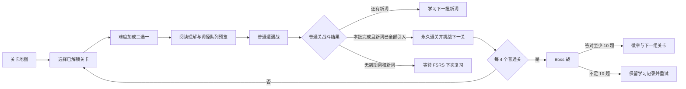

# 游戏化战斗垂直切片开发计划

> 状态：核心垂直切片已实现，持续优化  
> 更新日期：2026-07-23
> 目标版本：5 个节点的可玩垂直切片（4 个普通关 + 1 个 Boss）

## 1. 文档目的

本文档是“我是卷王 · 暴打单词怪”战斗游戏化的开发期单一真相。它记录下一阶段的产品目标、架构边界、实施顺序、测试门禁和停止条件，防止后续只记住视觉包装而忘记核心循环。

本文档属于尚未落地的开发设计，因此保存在代码仓库 `docs/` 中；实现完成后，代码和本文档必须同步更新。

## 2. 当前状态

### 已实现

- 本地优先的 Vite + React + TypeScript 静态应用，无后端依赖。
- FSRS 是唯一学习调度源，决定到期复习、题型阶段和长期稳定掌握。
- AI 按固定关卡词池生成阅读理解，失败时可离线回退。
- 每个普通关固定 25 个目标词；高考词库为 148 个普通词群关，并在每 4 个普通关后插入 1 个 Boss 节点。
- 每轮优先到期词，再引入最多 8 个新词；未到期词不用于凑数。
- 同一关的 25 个词分批引入；战斗胜利且新词全部引入后永久通关。
- Boss 固定 12 题、三阶段、一场结束，只复核前序已学词，不引入新词。
- 通关与长期掌握分离；到期复习不会重新锁关。
- 学习记录和跨词库覆盖率保存在浏览器本地。

### 尚未实现

- 完整本地行为事件导出与留存分析面板。
- 更多技能、怪物和声音资产。

## 3. 产品判断

当前产品已经解决：

- 学什么；
- 何时复习；
- 如何把单词放进阅读语境。

下一阶段要验证：

> 答题结果转化为攻击、连击、反击和 Boss 击败后，玩家是否更愿意完成当前关并继续下一关？

首版不追求“大而全的游戏系统”，只验证战斗核心循环是否成立。

## 4. 垂直切片范围

垂直切片包含：

1. 4 个普通关；
2. 1 个 Boss 节点；
3. 一只普通词怪及其待机、受击、攻击、击败状态；
4. 一只 Boss 及三个战斗阶段；
5. 连击、暴击、词怪反击和 Boss 及格线；
6. 累积难度加成三选一；
7. 一至三星结算；
8. 本地游戏进度和本地事件记录。

## 5. 目标用户流程



## 6. 核心战斗规则

### 6.1 普通遭遇战

- 一个现有 Memory Chain 对应一次词怪遭遇。
- 一次挑战最多使用两个 AI 阅读链；候选不足时自然缩短，不强制凑满。
- 每道题是一次攻防结算：
  - 正确：攻击命中；
  - 快速正确：显示暴击；
  - 连续正确：提高连击和表现分；
  - 错误或超时：词怪反击，连击清零；
  - 使用提示：不改变正确性，但降低表现奖励。
- 正确题可按默认倒计时自动进入下一题；错误题进入点评后必须默认暂停自动前进，由玩家阅读完原因后主动继续或直接进入下一题。
- 题目从作答进入阅卷时不得卸载或跳转到独立答案页；原题卡留在原位，玩家选择态必须保持，正确答案只叠加勾图标，不显示“选对/选错”文字；填空题原位锁定输入并显示正确答案。
- 因正确与否已在选项卡上直接标注，阅卷不再显示单独的“回答结果”说明；也不再在选项下方渲染独立的释义学习卡。本词学习进度（练习/答对/正确率）KPI 卡直接放在题卡内目标单词右侧，发音图标缩小后紧贴在音标行前。自动计时、下一题、AI 词汇教练在同题卡内纵向连续排列；词库归属以一行粘注置于底部。
- AI 词汇教练必须把词典中的每个中文义项逐项解释，并在展开区按原义项顺序显示词性、释义、助记技巧、用法指南和双语例句。Oxford 已有例句时原样复用，只有缺例句的义项才由 AI 补充；语法或技术术语还必须说明概念、标准结构、适用场景和常见错误。每个义项独立验收，已通过内容进入内部检查点，失败或人工重生成时只请求对应 `senseId`，全部义项完整后才原子发布整词记录。
- 即时原位标记与最终错题复盘复用同一结构化判定结果。
- 首版不得因动画或额外伤害跳过既定题目。FSRS 安排的题仍按顺序结算。

### 6.2 玩家状态

- 普通关没有额外生命或护盾门槛，必须完整走完本批题目；错误或超时触发词怪反击、清空连击并进入题内复盘，但不会截断剩余学习。
- 错词由 FSRS 记录为 Again 并自动安排重学，不使用第二套“扣血后再重背”规则重复惩罚。
- Boss 必须答满固定 12 题，至少答对 10 题才通过；不足 10 题视为本场未通过，但所有已答题目的学习记录照常保留。
- 普通关完成与长期掌握分离；完成本批不代表错误单词已经掌握。

### 6.3 连击与暴击

- 连续答对 2 题：连击开始。
- 连续答对 3 题：攻击反馈升级。
- 连续答对 5 题：触发所选技能的强化效果。
- 答错或超时：连击清零。
- 反应时间低于题目时限的 40% 时显示暴击。
- 连击和暴击影响战斗表现分、动画与星级，不改变 FSRS 评分。

### 6.4 学习进度与战斗胜负的关系

这两套状态必须分离：

- FSRS 学习进度决定到期复习、题型阶段和长期稳定掌握；
- 战斗状态决定本次挑战的胜负、连击、星级和奖励；
- 战斗胜利不得直接把单词标记为掌握；
- 战斗失败不得删除学习记录；
- 每关固定 25 个新词，每轮最多引入 8 个；胜利且 25 个词均已至少引入一次后永久解锁下一关；
- 战斗预览与结算必须显示本关已引入词数、剩余新词和预计剩余批次；“继续本关”必须标明下一批最多引入多少新词；
- 若最后一批战败但 25 词已全部引入，必须提供由 8 个薄弱词组成的有限通关复核，不得因没有新词或到期词而锁死重试入口；
- 已通关关卡只在存在到期词时提供复习入口，未到期词不得为了重玩而进入队列；
- FSRS Review 状态且稳定性达到 21 天才计入稳定掌握；稳定性达到 7 天后采用主动提取题型。

### 6.5 作答质量与 FSRS 评分

- 答错或超时：Again；
- 使用提示或接近时限才答对：Hard；
- 正常速度独立答对：Good；
- 非选择题中快速完成主动回忆：Easy；
- 选择题属于识别题，即使快速答对也最高为 Good。

### 6.6 频率混合与难度曲线

- 词库原始顺序是高频到低频，但关卡不得直接使用连续频率切片。
- 每关固定 25 个词，必须混合四个频率带，不能出现全高频或全低频的完整关卡。
- 关卡曲线从前期 `40% / 30% / 20% / 10%`（高频为主）平滑过渡到后期 `10% / 20% / 30% / 40%`（低频为主）。
- 每个可容纳四带的批次至少保留每带 1 个词；累计分配必须为后续关卡预留各带名额，避免尾段断带。
- 低于当前考试层级的基础词作为高频锚点分散到各关，不得集中堆在词库尾部形成连续简单关。
- “轻松”与“硬核”仅在当前混合关内偏向高频或低频，仍需保留所有可用频率带；“标准”保持关卡原始混合顺序。
- FSRS 到期复习优先级始终高于频率曲线，频率混合主要约束新词引入。

### 6.7 卷王激励指标（成就弹窗）

头部面板保持以词库为中心的学习指标（词库战绩：学习覆盖、稳定掌握、覆盖率环、词库切换），个人相关指标全部收进「卷王成就」弹窗，避免词库与个人数据混排打乱布局。

稳定掌握是科学慢指标（FSRS Review 且稳定性≥21 天），当日狂刷难以推动，容易缺乏冲刺成就感。为此在成就弹窗顶部增加三层快反馈闭环，全部由 `src/domain/grindMetrics.ts` 从现有 `LearningState`（每词 FSRS 卡 + 作答历史）纯函数派生，不改动 FSRS 调度与稳定掌握定义：

- **掌握阶梯**：每个已练词按 FSRS 卡片落入 初识（未进 Review）/ 巩固中（Review 且稳定性<21 天）/ 稳定掌握（≥21 天）/ 炉火纯青（≥60 天）四档，分段条 + 计数实时上涨。练一题即从生词进入初识/巩固中。
- **卷力值与段位**：只增不减的累计分 = 每次作答（作答 +1、答对再 +2）+ 每词新学 +5 + 各词阶梯累计奖励（巩固 +10、稳定 +50、炉火 +130）。段位 卷徒→卷士→卷侠→卷将→卷王→卷神（阈值 0/500/2000/6000/15000/40000），带“距下一段位”进度。
- **今日战报 + 日目标三环**：三环为 新学 / 复习 / 学习分钟（默认目标 10 / 20 / 15，每日清零可打破）；另显示今日卷力、今日正确率、今日最高连击，以及全局战绩（已学习 / 累计正确率 / 待复习 / 连续天数）。新学=当日首见词，复习=当日作答且首见日早于今天。

### 6.8 自适应题型与时限

普通学习与 Boss 共用同一组可测试题型，不允许组件存在但调度永远不触发：

- 首次接触：看单词，选择全部正确释义；
- Learning / Relearning：在看词识义与听音识义之间轮换；
- Review 且稳定性不足 7 天：在看义选词与语境填空之间轮换；
- 稳定性达到 7 天：在听音选词与听音拼写之间轮换；
- 无语音能力时，听音识义降级为看词识义，听音选词降级为看义选词，听音拼写降级为看义拼写。

基础时限按操作成本区分：看义选词 15 秒、看词识义 18 秒、听音识义/听音选词 20 秒、看义拼写/听音拼写 22 秒、语境填空 25 秒。`疾风`可以缩短时限，但输入题和听音题最低保留 15 秒；学习记录、暴击判定和画面倒计时必须使用同一个有效时限函数。

## 7. Boss 设计

### 7.1 出现节奏

- 每 4 个普通词群关插入一个 Boss 节点；最后不足 4 个普通关时，词库末尾仍以 Boss 收束。
- Boss 占地图节点编号，但不消耗 25 词块。例如节点 1–4 是普通关，节点 5 是 Boss，节点 6 才承接下一组 25 个新词。
- 旧地图进度读取时迁移到布局版本 2：普通词群关按插入的 Boss 数量右移，旧 Boss 星级与徽章同时保留；FSRS 学习记录不参与迁移且不受影响。

### 7.2 Boss 词池

- Boss 不拥有新词池，从前 1–4 个普通关已经引入的词中固定抽取 12 个不重复词。
- 12 题由 6 个薄弱词和 6 个覆盖不同位置的代表词组成。
- 薄弱排序依据现有学习状态：
  1. 到期且答错率高；
  2. Relearning 状态；
  3. 稳定性低；
  4. 最近反应慢。
- Boss 选词逻辑必须是确定性的纯函数，并有单元测试。

### 7.3 三阶段

1. **识破（4 题）**：看词选义与听音选义交替；
2. **破甲（4 题）**：看义选词与听音选词交替；
3. **终结（4 题）**：看义拼写、语境填空、听音拼写组成主动提取。

Boss 共 12 题，答完第 4 题与第 8 题后分别切换第二、第三形态。必须答完整场，至少答对 10 题才通过并解锁下一节点；Boss 不存在“学习下一批”。未通过不回滚已记录的 FSRS 作答，重试仍为固定 12 题，刚答错的词会因薄弱排序优先进入下一次计划。

## 8. 累积难度加成

每次挑战前从仍可升级的加成中随机提供三个，玩家选择一个后立即作用于当前关并跨关保留。任意题答错会在下一次战前整备时随机移除一层已有加成；全部加成达到上限后直接保持当前强度开战。

| 加成 | 挑战效果 | 上限 |
| --- | --- | ---: |
| 疾风 | 每层将所有题目的作答时间再缩短 10%；输入与听音题最低保留 15 秒 | 5 |
| 蒙面 | 词怪不再提供额外点读，只能依靠题面线索 | 1 |
| 隐数 | 识义题不再提示正确释义数量 | 1 |
| 断章 | 预览保留阅读原文，正式答题后隐藏原文 | 1 |
| 拟态 | 看义题优先同词性近词频；听音辨词优先相近发音 | 1 |
| 人海 | 每层为支持的选择题增加 1 个干扰项 | 2 |

所有加成只改变挑战条件，不得修改答案判定、FSRS 评分、卡片稳定性或长期掌握状态。“拟态”和“人海”共用领域层选项构造器：前者决定干扰项质量，后者决定数量。

## 9. 领域架构

### 9.1 新增纯领域模块

#### `src/domain/combat.ts`

职责：

- `CombatState`；
- `CombatAction`；
- 战斗 reducer；
- 连击、暴击、反击表现和普通/Boss 结算门槛；
- 纯函数，无 React、DOM、存储或 FSRS 依赖。

建议输入：

```ts
interface ResolvedCombatAnswer {
  correct: boolean;
  responseTimeMs: number;
  timeLimitMs: number;
  mode: GameMode;
  usedHint: boolean;
}
```

#### `src/domain/boss.ts`

职责：

- 从前序普通关词池确定 6 个薄弱词和 6 个代表词；
- 生成固定 12 题、4+4+4 三阶段题型计划；
- 根据语音能力提供确定性的非音频降级，不在运行时随机改变题型。

#### `src/domain/gameProgress.ts`

职责：

- 游戏进度类型；
- 默认值与版本迁移；
- 星级、最高连击、Boss 徽章和累计击败数更新。

### 9.2 新增 Hook

#### `src/hooks/useCombat.ts`

职责：

- 维护当前战斗状态；
- 接收已结算答案事件；
- 输出短生命周期表现事件，例如 `hit / critical / hurt / defeated`；
- 不负责写 FSRS。

#### `src/hooks/useGameProgress.ts`

职责：

- 使用 IndexedDB 保存独立游戏进度；
- 存储 key：`wordbuddy.game.progress.v1`；
- 不修改现有 `LearningState.version`。

### 9.3 现有模块改造

#### `src/hooks/useGameSession.ts`

- 增加独立的 `onAnswerResolved` 回调；
- 回调只传作答事实，不传战斗结果；
- 现有 `onRecord` 继续只负责学习记录。

#### `src/components/PracticeSession.tsx`

- 用 `BattleScene` 统一承载预览、普通遭遇和 Boss 三阶段；
- 根据计划渲染七种题型，题型组件只负责作答与阅卷，不实现战斗逻辑；
- 普通关显示本关已引入词数、剩余新词和预计批次，Boss 显示当前阶段与 `题号 / 12`；
- 完成页分开表达本次战斗结果、普通关引入进度和 FSRS 长期掌握状态。

## 10. 游戏进度模型

游戏数据与学习数据分开保存：

```ts
interface GameProgressV1 {
  version: 1;
  journeyLayoutVersion: 2;
  levelResults: Record<string, {
    stars: 0 | 1 | 2 | 3;
    bestCombo: number;
    bestScore: number;
    wins: number;
    attempts: number;
    updatedAt: string;
  }>;
  clearedLevels: string[];
  clearedBossLevels: string[];
  totals: {
    monstersDefeated: number;
    criticalHits: number;
    highestCombo: number;
  };
}
```

所有地图节点统一使用 `${bankId}:level:${levelNumber}`。Boss 通关节点另存于
`clearedBossLevels`，不维护第二套结果结构。`journeyLayoutVersion: 2` 负责把旧版连续
25 词关编号一次性迁移到“每 4 个普通关插入 Boss”的节点编号；迁移只处理游戏进度，
不读取或改写 FSRS 学习记录。

## 11. UI 组件

当前组件边界：

- `Dashboard.tsx`：普通关/Boss 节点、有限关卡进度和入口文案；
- `ChallengePrep.tsx`：累积难度加成三选一与 Boss 12 题规则说明；
- `BattleScene.tsx`：完整战斗场景、顶部信息、阅读条、怪物舞台和题目区；
- `BattleHeader.tsx`：退出、关卡/模式和连击；
- `CombatHud.tsx`：普通词怪队列或 Boss 阶段美术；
- `MonsterRoster.tsx`：普通词怪 3D 圆环转台、点读和漫画对话；
- `PracticeSession.tsx`：七种题型、题内阅卷、批次/Boss 结算与下一步；
- `InlineQuestionReview.tsx`：自动前进、下一题、AI 教练和词库归属。

训练页目标布局：

```text
桌面 / 平板：
┌────────────── 第一人称战斗场景 ──────────────┐
│ [退出 / 关卡与模式 / 连击]                     │
│ [可选阅读理解条；Boss 显示题号与阶段]           │
│                                               │
│         漫画对话 → 当前词怪 / Boss             │
│            其余词怪向两侧后退                  │
│                                               │
│ [本关引入进度 / Boss 规则]         [开始挑战]  │
│ [计时 / 当前题型 / 选项或输入 / 题内阅卷]       │
└───────────────────────────────────────────────┘

手机预览保持上方头部、中部怪物/Boss、下方独立开始区。漫画对话不得覆盖头部，
放大后的怪物视觉边界不得侵入开始区；Boss 三阶段说明改为单列并保持足够对比度。

正式考核使用紧凑怪物带，题目面板占据剩余视口。交卷或超时后题目组件保持挂载，
在原选项/输入框上完成阅卷；学习反馈在其下方继续展开，不切换页面。普通关阅读
原文由“断章”加成决定是否保留；Boss 不生成 AI 阅读串。
```

交互约束：

- 挑战态必须固定覆盖完整 `100dvw × 100dvh`，不受站点 `page-width`、居中卡片或固定场景高度限制；
- 战场从视口 `(0, 0)` 铺满窗口，不使用外层边框、圆角或页面留白；
- 挑战态禁止页面级水平与垂直滚动；长选项、答案反馈和语境只能在各自面板内部滚动；
- 内部滚动须保留触摸、滚轮和键盘能力，但隐藏可见滚动轨道，避免误读为页面滚动条；
- 普通关预览必须明确显示 `已引入 / 25`、剩余新词和预计批次；Boss 必须明确显示固定 12 题、4+4+4 三阶段且一场结束；
- 预览开始区独立位于怪物下方，桌面和手机均不得与怪物、漫画对话或头部重叠；
- 怪物头顶不重复显示目标单词，只有焦点怪显示短漫画对话；点击怪物可点读，启用“蒙面”后禁用这项额外点读；
- 焦点怪挑衅必须由纯函数根据词频稀有度、词长难度、学习阶段、历史错误次数、当前连击和回合号生成，并分为试探/强势/压迫/宿敌四级。历史错误达到 3 次进入宿敌级并直接引用错误或交手次数；低频长难词和 5 连击以上至少进入压迫级。同词在不同回合必须轮换措辞，答对/答错后使用独立反应池。任何台词都不得直接包含目标英文，避免听音题泄题。
- 正式答题中的发音按钮使用紧凑小图标，紧贴目标单词的音标行；听音题隐藏目标词时，图标放在题型提示前。
- 普通关存在 AI 阅读时在怪物上方显示阅读条；Boss 不显示伪造阅读正文；
- 进入关卡后不渲染全局 Logo、发音、AI 和主题工具栏；战前技能选择页同样使用沉浸模式；
- 场景顶部只保留退出、关卡/模式和连击；手机为单行三列，返回按钮后必须立即衔接标题，不得为已删除状态预留空列。普通关不重复显示数字题目进度，Boss 在模式标题中显示 `题号 / 12` 与当前阶段；
- 练习页不得再叠加第二套退出工具栏或外部进度条；
- 操作区必须优先进入首屏，不得被敌人或长段落推到页面下方；
- 正式答题的怪物区使用固定紧凑高度并保持上下均衡，题卡占用其余视口；整组词怪固定在一个完整 3D 圆环的等角槽位，当前对决词怪位于圆弧最前端、最大且居中。切题时只旋转整个刚性转台一格，所有怪物沿同一圆弧连续运动：已答怪退向左后方，下一只从右后方转到玩家眼前，远端怪靠近地平线并缩小、变淡。桌面圆弧应充分使用横向舞台且相邻前景怪不得重叠；手机压缩半径但保留同一运动模型，4–8 只均不得横向截断或覆盖题卡。
- 手机预览存在 AI 阅读原文时，原文、怪物转台和开始区必须使用三个独立高度段：原文限制高度并在自身内部滚动，转台保留约 220px 舞台，漫画气泡与怪物都不得被原文遮挡；无原文时允许转台使用更大的垂直空间。
- 自动计时、下一题和 AI 词汇教练组成统一底部工具组，必须位于当前题目选项之后；窄屏改为单列且不得溢出。
- 目标单词、小发音图标（紧贴音标行前）与本词 KPI 同行展示，不再在选项下方渲染独立释义卡；词库归属以单行粘注置于底部。
- 段落只显示已经完成考核的目标词，当前词和后续词的所有变形均保持遮罩；
- 本组全部考核完成前不显示段落译文；
- 段落遮罩由会话索引确定，不依赖临时动画或题型切换，避免答案闪现；
- 没有可用英语音色或播放进入错误态时，不生成听音题；运行中播放失败时，当前和后续听音题立即降级为选择题。

怪兽表现时序：

- 普通命中：受击 280ms 后恢复当前待机形态；
- 暴击：临时倒地 650ms，起身 350ms，再恢复当前待机形态；
- 反击：攻击 360ms 后恢复当前待机形态；
- 生命归零：保持击败形态，不再恢复；
- Boss 恢复后按照当前血量回到对应阶段，不回退到第一阶段；
- 表现时序属于 UI 层，不修改伤害、答题判定、题目计时或 FSRS 学习记录。

## 12. 视觉与声音资产

垂直切片最低资产清单：

- 普通词怪透明 PNG：待机、受击、攻击、击败；
- Boss 透明 PNG：三个阶段及击败状态；
- 5 个技能图标；
- 命中、暴击、受伤、胜利、失败共 5 组短音效；
- 一枚 Boss 徽章。

要求：

- 优先使用项目内位图资源；
- 单个资源需压缩，避免大图拖慢静态站点；
- 支持静音；
- 支持 `prefers-reduced-motion`，低动效模式禁用震动和强闪烁；
- 不自动下载大型素材或模型。

## 13. 开发阶段与排期

### P0：基线与事件记录（0.5–1 天）

- 记录当前版本的关卡开始、完成、下一关点击和中途退出；
- 数据仅存本地，可导出 JSON；
- 建立改造前基线。

完成门槛：同一用户流程不会重复记录；关闭记录后不影响学习。

### P1：战斗领域引擎（2 天）

- 实现 `combat.ts` reducer；
- 实现连击、暴击、反击反馈和普通/Boss 结算；
- 覆盖边界测试和随机 action 序列测试。

完成门槛：纯领域测试全绿；移除战斗 UI 后 FSRS 测试结果不变。

### P2：普通遭遇战 UI（3 天）

- 实现 Combat Arena/HUD；
- 接通七种题型及无语音降级；
- 实现命中、受击、暴击、失败和胜利反馈；
- 先使用一只普通词怪完成 4 个普通关。

完成门槛：作答后 100ms 内出现反馈；桌面和手机无布局位移；失败不丢学习记录。

### P3：战前技能（1–1.5 天）

- 实现 6 个累积难度加成；
- 每场从未满级加成中三选一，全部满级后保持当前强度开战；
- 加成只改变时限、提示、干扰项和选项数，不改变答案或 FSRS 记录。

完成门槛：每个技能有纯函数测试；任何技能均不改变 FSRS 答案记录。

### P4：Boss 节点与 Boss 战（2 天）

- 地图插入 Boss 节点；
- 实现薄弱词选择；
- 实现三阶段 Boss；
- 实现胜负与重试。

完成门槛：Boss 固定 12 题且只复核前序已学词；三阶段严格 4+4+4；至少答对 10 题才通过；未通过时学习记录不回滚；通过后直接解锁下一节点，不出现“学习下一批”。

### P5：结算和游戏进度（1–1.5 天）

- 实现一至三星；
- 保存最高连击、最高分、Boss 徽章；
- 完成页展示稳定掌握、剩余到期词/新词和下一次复习时间。

星级基线：

- 一星：完成战斗；
- 二星：本次正确率至少 80%；
- 三星：正确率至少 90% 且最高连击至少 5。

### P6：打磨与发布验证（2 天）

- 浅色/深色；
- 桌面/平板/手机；
- AI 正常/超时/离线；
- 静音和低动效模式；
- 性能、键盘和屏幕阅读器检查；
- 完整 `npm run check`。

总预估：10–12 个开发日。

## 14. 自动测试矩阵

### 领域测试

- 连击增长和清零；
- 暴击阈值；
- 普通关连续答错仍完成全批、Boss 9/12 未通过与 10/12 通过；
- 技能效果；
- Boss 薄弱词池；
- Boss 阶段切换；
- 星级与最高记录更新；
- 游戏进度迁移。
- FSRS 五状态分类、21 天稳定掌握和四档评分；
- 队列只包含到期词和限额新词，未到期词不凑数；
- 胜利但仍有新词时不提前清关。

### 集成测试

- 答案同时更新 FSRS 和战斗状态，但两者互不依赖；
- `asking → answered` 保留同一题型组件实例，并在原选项上输出语义化阅卷状态；
- 超时、手动提交和多选草稿均进入同一题内反馈组件；
- 战斗失败后已答题记录保留；
- 下一关启动正确的固定 25 词池，每轮最多 8 个新词；
- Boss 从前序已学词生成 12 个不重复考核词，且不调用 AI 阅读生成；
- 普通关最后一批战败且没有新词/到期词时，可生成有限弱词复核并重新挑战通关；
- 关闭战斗表现时，学习流程与当前版本一致。

### 浏览器验收

- 七种题型及无语音降级路径的命中/受击反馈；
- Boss 第 1/5/9 题分别进入识破、破甲、终结，听音选词的“拟态”干扰优先使用相近音标；
- 超时后原题卡仍存在，玩家选择态保留，所有正确答案显示勾图标；错误选择不显示勾，且页面不得出现“选对/选错”文字标签；
- 阅卷不显示单独的“回答结果”说明，也不再渲染独立释义卡；本词学习进度 KPI 卡与小发音图标都位于题卡内目标单词旁；圆环转台词怪不拥挤、不遮挡顶部信息，焦点变化必须产生可见的整环旋转而不是瞬移；
- 自动计时、下一题、AI 词汇教练位于选项下方，桌面同排、手机单列且无水平溢出；
- AI 配置可用时可展开 AI 词汇教练（在当前题卡内展开），讲解正文后必须显示每个中文义项对应的例句与翻译；未配置时点击引导先完成 AI 连接，教练关闭时不渲染例句入口或占位提示；
- 连击和暴击动画；
- 技能选择与剩余次数；
- Boss 三阶段；
- 胜利、失败、学习下一批、等待到期复习和挑战下一关；
- 手机无重叠和横向溢出；
- `prefers-reduced-motion` 下无震动和强闪烁。

## 15. 发行验证指标

先记录改造前基线，再评估垂直切片：

| 指标 | 继续投入门槛 |
| --- | ---: |
| 首关完成率 | ≥ 75% |
| 完成一关后点击下一关 | ≥ 45% |
| 单次启动平均完成关数 | ≥ 2.5 |
| Boss 到达率 | ≥ 35% |
| 次日回访率 | ≥ 25% |

垂直切片不引入后端。首轮事件记录保存在本地：

- `level_started`；
- `answer_resolved`；
- `combo_reached`；
- `battle_won`；
- `battle_failed`；
- `next_level_clicked`；
- `session_abandoned`。

公开发行前再决定是否增加经过用户同意的匿名遥测。

## 16. 停止条件

出现以下情况时停止扩展内容，继续打磨核心战斗：

- 首关完成率低于 60%；
- 下一关点击率低于 30%；
- 多数测试者无法解释连击或难度加成的作用；
- 战斗表现干扰阅读理解或明显增加答题错误；
- 手机端反馈延迟超过 150ms；
- 战斗层开始要求修改 FSRS 算法才能成立。

## 17. 明确非目标

垂直切片阶段不做：

- 商城和多货币；
- 随机装备词条；
- 公会与排行榜；
- 联机对战；
- 多角色养成；
- 大量 AI 剧情；
- 付费系统；
- 为了游戏胜负伪造或覆盖学习掌握数据。

## 18. 后续扩展条件

只有发行验证指标达到门槛后，才进入下一阶段：

1. 每日任务；
2. 更多词怪行为；
3. 徽章图鉴与称号；
4. 章节背景变化；
5. 外观奖励；
6. 好友挑战或排行榜。

在核心循环未验证前，不扩建这些系统。